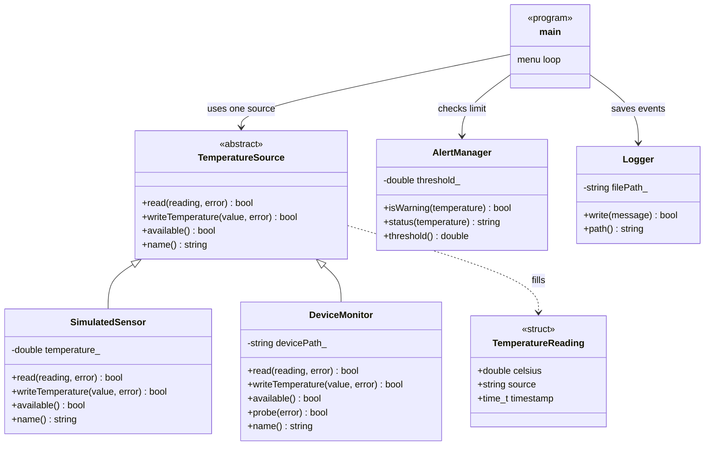
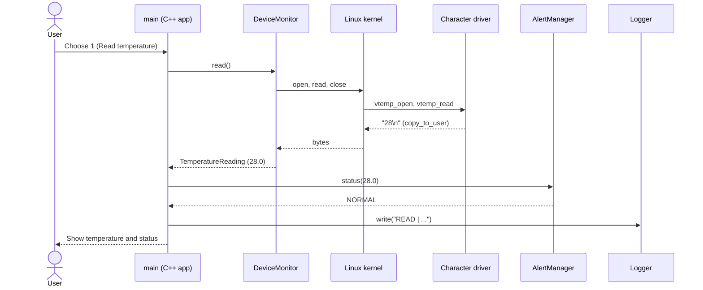
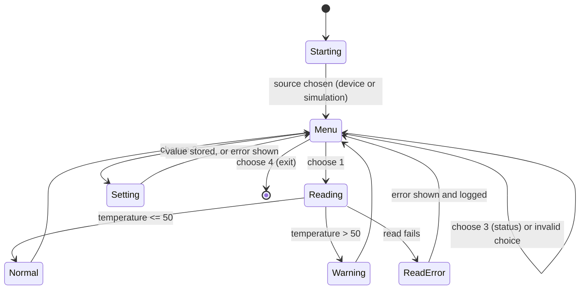

# UML Diagrams – Stage 3

The first drafts were made during design. After implementation (Stage 4–5) they were
updated so that they match the final code in `include/` and `src/`.

## Class Diagram

**How to read it**

- `TemperatureSource` is an abstract class (like a Java interface). `main` only knows this type.
- `SimulatedSensor` and `DeviceMonitor` are the two real sources.
- `AlertManager` and `Logger` are used by `main`; they do not know about each other.

## Sequence Diagram – device mode

In **simulation mode** the steps with Kernel and Driver are skipped:
`main` calls `SimulatedSensor::read()`, which returns its stored value.

## State Machine Diagram

The source  is chosen once, at start-up.
