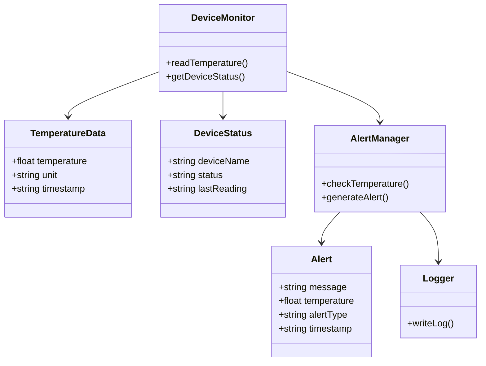
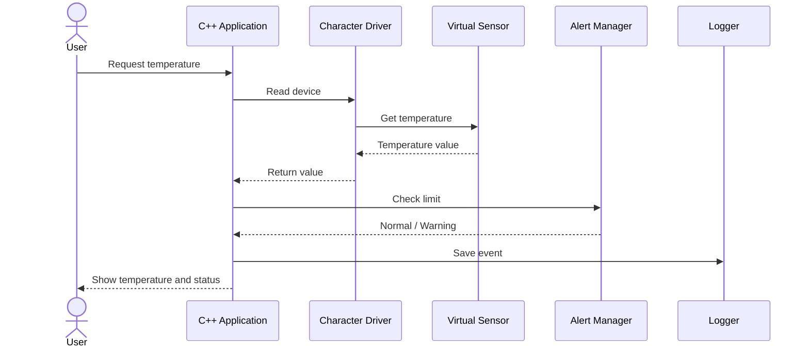
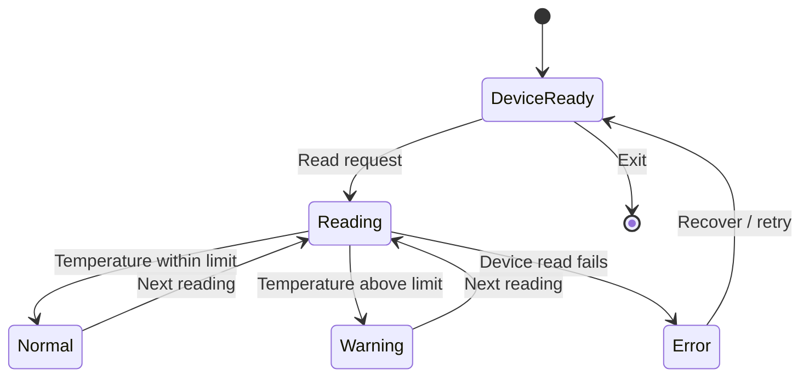

# UML Diagrams – Stage 3

These are the current design drafts. They can be adjusted during implementation.

## Class Diagram

```mermaid
classDiagram
    class TemperatureData {
        +float temperature
        +string unit
        +string timestamp
    }

    class DeviceStatus {
        +string deviceName
        +string status
        +string lastReading
    }

    class Alert {
        +string message
        +float temperature
        +string alertType
        +string timestamp
    }

    class DeviceMonitor {
        +readTemperature()
        +getDeviceStatus()
    }

    class AlertManager {
        +checkTemperature()
        +generateAlert()
    }

    class Logger {
        +writeLog()
    }

    DeviceMonitor --> TemperatureData
    DeviceMonitor --> DeviceStatus
    DeviceMonitor --> AlertManager
    AlertManager --> Alert
    AlertManager --> Logger
```

## Sequence Diagram

```mermaid
sequenceDiagram
    actor User
    participant App as C++ Application
    participant Driver as Character Driver
    participant Sensor as Virtual Sensor
    participant Alert as Alert Manager
    participant Log as Logger

    User->>App: Request temperature
    App->>Driver: Read device
    Driver->>Sensor: Get temperature
    Sensor-->>Driver: Temperature value
    Driver-->>App: Return value
    App->>Alert: Check limit
    Alert-->>App: Normal / Warning
    App->>Log: Save event
    App-->>User: Show temperature and status
```

## State Machine Diagram

```mermaid
stateDiagram-v2
    [*] --> DeviceReady

    DeviceReady --> Reading: Read request
    Reading --> Normal: Temperature within limit
    Reading --> Warning: Temperature above limit

    Normal --> Reading: Next reading
    Warning --> Reading: Next reading

    Reading --> Error: Device read fails
    Error --> DeviceReady: Recover / retry

    DeviceReady --> [*]: Exit
```
